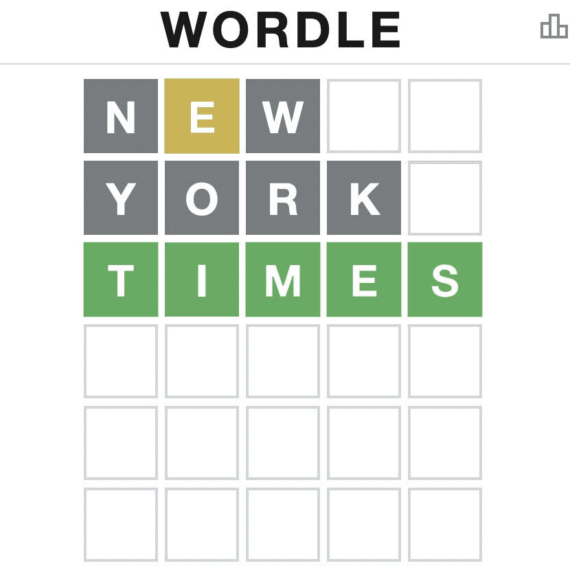
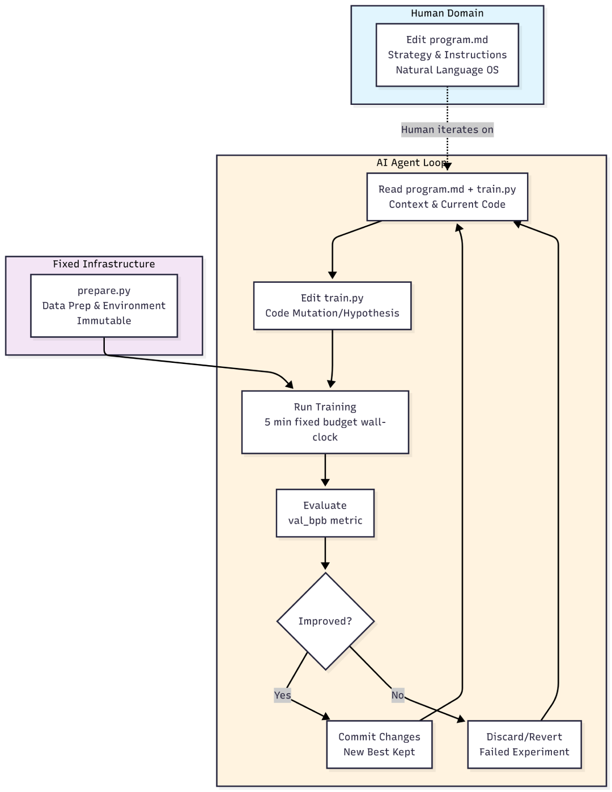
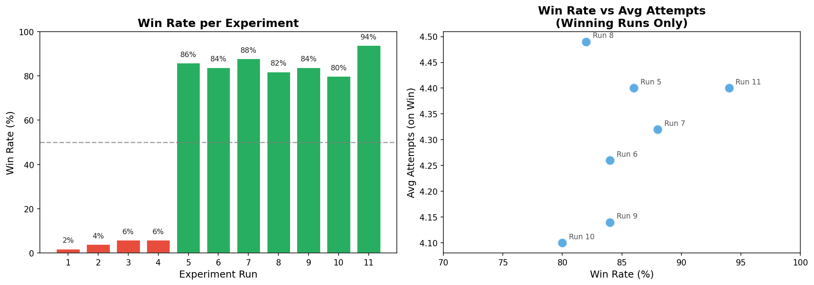

<!-- end_slide -->

Common Wordle Algorithms
===

- Decision Trees
- Q-Learning
- Greedy Algorithms
- Entropy Maximization

<!-- end_slide -->

<!-- jump_to_middle -->

Can we get much higher?
===

<!-- end_slide -->

Introducing Autoresearch
===

<!-- column_layout: [1,2] -->

<!-- column: 0 -->

- Invented by **Andrej Karpathy**
- Self-optimizing programs by looping agent calls

<!-- column: 1 -->



<!-- end_slide -->

Autoresearch for Wordle
===

## Objective

Achieve the lowest average number of attempts to win games.

## Metrics

- **Primary**: `avg_attempts_on_win` (attempts, lower is better) — average number of guesses needed when the agent successfully wins a game
- **Secondary**:
  - `win_rate` (percentage, higher is better) — percentage of games won
  - `avg_attempts` (attempts, lower is better) — average attempts across all games (including losses)

<!-- end_slide -->

Training Loop
===



<!-- end_slide -->

Winning Algorithm
===

```python
candidates = all_words                  # pool of possible answers
constraints = {}                        # {position: letter, forbidden: {pos: letters}}

def guess(history):
   for feedback in history:
       constraints += parse(feedback)   # update constraints
   candidates = filter(candidates, constraints)
   return max(candidates, key=lambda w: score(w, constraints))
```

The end solution uses a greedy entropy-style approach: after each guess, it filters candidate words using the feedback constraints and picks the word that maximizes letter frequency while exploring new letters.

<!-- end_slide -->

In conclusion...
===

## Is it the world's best Wordle solver?

Maybe not.

## How much did it cost?

~1 USD to run the loop for 11 experiments (~30 mins), using `minimax-m2.5`

## Isn't this just deep learning with extra steps?

Yes.

## Is this practical?

That's what we're finding out.

## Was it fun?

**Very!**

<!-- end_slide -->

<!-- jump_to_middle -->

Thanks for listening!
===

<!-- alignment: center -->
github.com/jarcelao/wordle-autoresearch


